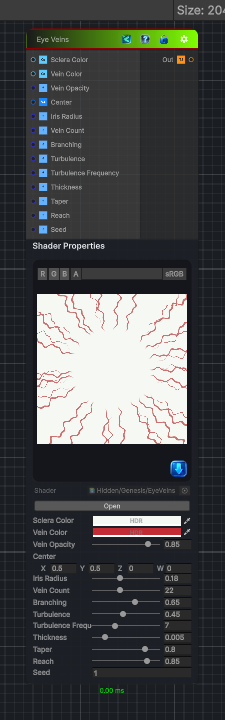

<link rel="stylesheet" href="../_assets/theme.css">

<button type="button" class="genesis-theme-toggle" data-genesis-theme-toggle aria-label="Toggle theme">Dark</button>

---
category: "Generators/Pattern"
---

# Eye Veins

> Generates a radial, branching vein mask suitable for an eye sclera.

## Description

Generates a radial, branching vein mask suitable for an eye sclera.

Inputs:
- Center controls the pupil and iris position.
- Iris Radius defines the vein-free area around the iris.
- Vein Count controls the number of primary vessels.
- Branching adds smaller vessels alongside each primary vein.
- Turbulence and Frequency control vessel waviness.
- Thickness and Taper control vessel width.
- Reach controls how far vessels extend toward the iris.
- Seed generates a different deterministic pattern.

Output:
- A colored sclera texture with veins blended over the surface.

## Inputs

| Name | Type | Description |
|------|------|-------------|
| Sclera Color | Color |  |
| Vein Color | Color |  |
| Vein Opacity | Single |  |
| Center | Vector4 |  |
| Iris Radius | Single |  |
| Vein Count | Single |  |
| Branching | Single |  |
| Turbulence | Single |  |
| Turbulence Frequency | Single |  |
| Thickness | Single |  |
| Taper | Single |  |
| Reach | Single |  |
| Seed | Single |  |

## Outputs

| Name | Type |
|------|------|
| Out | Texture2D |

## Parameters

| Setting | Type | Default | Description |
|---------|------|---------|-------------|
| Sclera Color | Color | (0.92, 0.95, 0.90, 1.0) | Controls the sclera color. |
| Vein Color | Color | (0.55, 0.025, 0.035, 1.0) | Controls the vein color. |
| Vein Opacity | Range | 0.85 | Controls the vein opacity. |
| Center | Vector | (0.5, 0.5, 0, 0) | Controls the center. |
| Iris Radius | Range | 0.18 | Controls the iris radius. |
| Vein Count | Range | 22 | Controls the vein count. |
| Branching | Range | 0.65 | Controls the branching. |
| Turbulence | Range | 0.45 | Controls the turbulence. |
| Turbulence Frequency | Range | 7.0 | Controls the turbulence frequency. |
| Thickness | Range | 0.005 | Controls the thickness. |
| Taper | Range | 0.8 | Controls the taper. |
| Reach | Range | 0.85 | Controls the reach. |
| Seed | Float | 1.0 | Controls the seed. |

## See Also

- [Back to Eye Veins](./generators-index.md)
