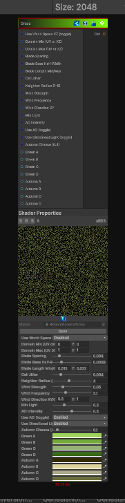

<link rel="stylesheet" href="../_assets/theme.css">

<button type="button" class="genesis-theme-toggle" data-genesis-theme-toggle aria-label="Toggle theme">Dark</button>

---
category: "Generators/Pattern"
---

# Grass

> Generates grass procedural noise.

## Description

Generates grass procedural noise.

Inputs:
- No external inputs. This node generates its output from its internal parameters.

Settings:
- No additional settings. This node is controlled by its built-in behavior.

Output:
- A generated procedural texture based on the node parameters.

## Inputs

| Name | Type | Description |
|------|------|-------------|

## Outputs

| Name | Type |
|------|------|

## Parameters

| Setting | Type | Default | Description |
|---------|------|---------|-------------|
| Use World Space XZ (toggle) | Enum | 0 | Controls the use world space xz (toggle). |
| Domain Min (UV or XZ) | Vector2 | (0,0,0,0) | Controls the domain min (uv or xz). |
| Domain Max (UV or XZ) | Vector2 | (1,1,0,0) | Controls the domain max (uv or xz). |
| Blade Spacing | Range | 0.004 | Controls the blade spacing. |
| Blade Base Half-Width | Range | 0.0008 | Controls the blade base half-width. |
| Blade Length Min/Max | Vector2 | (0.012, 0.022, 0, 0) | Controls the blade length min/max. |
| Cell Jitter | Range | 0.004 | Controls the cell jitter. |
| Neighbor Radius (1-8) | Range | 4 | Controls the neighbor radius (1-8). |
| Wind Strength | Range | 0.05 | Controls the wind strength. |
| Wind Frequency | Range | 2.1 | Controls the wind frequency. |
| Wind Direction XY | Vector2 | (0.6, 1.0, 0, 0) | Controls the wind direction xy. |
| Min Light | Range | 0.3 | Controls the min light. |
| AO Intensity | Range | 0.5 | Controls the ao intensity. |
| Use AO (toggle) | Enum | 1 | Controls the use ao (toggle). |
| Use Directional Light (toggle) | Enum | 1 | Controls the use directional light (toggle). |
| Autumn Chance (0..1) | Range | 0.1 | Controls the autumn chance (0..1). |
| Green A | Color | (0.618, 0.831, 0.361, 1) | Controls the green a. |
| Green B | Color | (0.451, 0.659, 0.231, 1) | Controls the green b. |
| Green C | Color | (0.580, 0.698, 0.459, 1) | Controls the green c. |
| Green D | Color | (0.227, 0.412, 0.09, 1) | Controls the green d. |
| Autumn A | Color | (0.208, 0.165, 0.024, 1) | Controls the autumn a. |
| Autumn B | Color | (0.861,0.821,0.604, 1) | Controls the autumn b. |
| Autumn C | Color | (0.671, 0.667, 0.557, 1) | Controls the autumn c. |
| Autumn D | Color | (0.427, 0.435, 0.247, 1) | Controls the autumn d. |

## See Also

- [Back to Grass](./generators-index.md)
