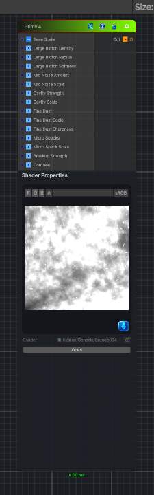

<link rel="stylesheet" href="../_assets/theme.css">

<button type="button" class="genesis-theme-toggle" data-genesis-theme-toggle aria-label="Toggle theme">Dark</button>

---
category: "Generators/Pattern"
---

# Grime 4

> Generates grime 4 procedural noise.

## Description

Generates grime 4 procedural noise.

Inputs:
- No external inputs. This node generates its output from its internal parameters.

Settings:
- No additional settings. This node is controlled by its built-in behavior.

Output:
- A generated procedural texture based on the node parameters.

## Inputs

| Name | Type | Description |
|------|------|-------------|
| Base Scale | Vector4 |  |
| Large Blotch Density | Single |  |
| Large Blotch Radius | Single |  |
| Large Blotch Softness | Single |  |
| Mid Noise Amount | Single |  |
| Mid Noise Scale | Single |  |
| Cavity Strength | Single |  |
| Cavity Scale | Single |  |
| Fine Dust | Single |  |
| Fine Dust Scale | Single |  |
| Fine Dust Sharpness | Single |  |
| Micro Specks | Single |  |
| Micro Speck Scale | Single |  |
| Breakup Strength | Single |  |
| Contrast | Single |  |

## Outputs

| Name | Type |
|------|------|
| Out | Texture2D |

## Parameters

| Setting | Type | Default | Description |
|---------|------|---------|-------------|
| nodeVariables | VariableStorage | AhahGames.GenesisNoise.Graph.VariableStorage | |
| GUID | String | 55699629-d244-4108-9dc6-24d81510fcfd | |
| expanded | Boolean | False | |

## See Also

- [Back to Grime 4](./generators-index.md)
