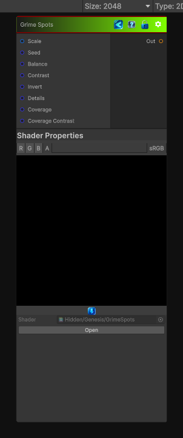

<link rel="stylesheet" href="../_assets/theme.css">

<button type="button" class="genesis-theme-toggle" data-genesis-theme-toggle aria-label="Toggle theme">Dark</button>

---
category: "Generators/Pattern"
---

# Grime Spots

> Generates grime spots procedural noise.

## Description

Generates grime spots procedural noise.

Inputs:
- No external inputs. This node generates its output from its internal parameters.

Settings:
- No additional settings. This node is controlled by its built-in behavior.

Output:
- A generated procedural texture based on the node parameters.

## Inputs

| Name | Type | Description |
|------|------|-------------|

## Outputs

| Name | Type |
|------|------|

## Parameters

| Setting | Type | Default | Description |
|---------|------|---------|-------------|
| Scale | Vector2 | (4,4,0,0) | Controls the scale. |
| Seed | Float | 0.0 | Controls the seed. |
| Balance | Range | 0.5 | Controls the balance. |
| Contrast | Range | 3.0 | Controls the contrast. |
| Invert | Toggle | 0 | Controls the invert. |
| Details | Range | 0.4 | Controls the details. |
| Coverage | Range | 0.5 | Controls the coverage. |
| Coverage Contrast | Range | 2.0 | Controls the coverage contrast. |

## See Also

- [Back to Grime Spots](./generators-index.md)
