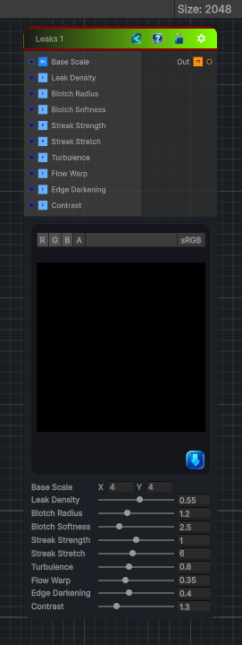

<link rel="stylesheet" href="../_assets/theme.css">

<button type="button" class="genesis-theme-toggle" data-genesis-theme-toggle aria-label="Toggle theme">Dark</button>

---
category: "Generators/Pattern"
---

# Leaks 1

> Generates leaks node 1 procedural noise.

## Description

Generates leaks node 1 procedural noise.

Inputs:
- No external inputs. This node generates its output from its internal parameters.

Settings:
- No additional settings. This node is controlled by its built-in behavior.

Output:
- A generated procedural texture based on the node parameters.

## Inputs

| Name | Type | Description |
|------|------|-------------|
| Base Scale | Vector4 |  |
| Leak Density | Single |  |
| Blotch Radius | Single |  |
| Blotch Softness | Single |  |
| Streak Strength | Single |  |
| Streak Stretch | Single |  |
| Turbulence | Single |  |
| Flow Warp | Single |  |
| Edge Darkening | Single |  |
| Contrast | Single |  |

## Outputs

| Name | Type |
|------|------|
| Out | Texture2D |

## Parameters

| Setting | Type | Default | Description |
|---------|------|---------|-------------|
| Base Scale | Vector2 | (4,4,0,0) | Controls the base scale. |
| Leak Density | Range | 0.55 | Controls the leak density. |
| Blotch Radius | Range | 1.2 | Controls the blotch radius. |
| Blotch Softness | Range | 2.5 | Controls the blotch softness. |
| Streak Strength | Range | 1.0 | Controls the streak strength. |
| Streak Stretch | Range | 6.0 | Controls the streak stretch. |
| Turbulence | Range | 0.8 | Controls the turbulence. |
| Flow Warp | Range | 0.35 | Controls the flow warp. |
| Edge Darkening | Range | 0.4 | Controls the edge darkening. |
| Contrast | Range | 1.3 | Controls the contrast. |

## See Also

- [Back to Leaks 1](./generators-index.md)
