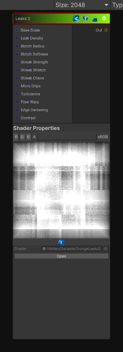

<link rel="stylesheet" href="../_assets/theme.css">

<button type="button" class="genesis-theme-toggle" data-genesis-theme-toggle aria-label="Toggle theme">Dark</button>

---
category: "Generators/Pattern"
---

# Leaks 2

> Generates leaks node 2 procedural noise.

## Description

Generates leaks node 2 procedural noise.

Inputs:
- No external inputs. This node generates its output from its internal parameters.

Settings:
- No additional settings. This node is controlled by its built-in behavior.

Output:
- A generated procedural texture based on the node parameters.

## Inputs

| Name | Type | Description |
|------|------|-------------|

## Outputs

| Name | Type |
|------|------|

## Parameters

| Setting | Type | Default | Description |
|---------|------|---------|-------------|
| Base Scale | Vector2 | (4,4,0,0) | Controls the base scale. |
| Leak Density | Range | 0.65 | Controls the leak density. |
| Blotch Radius | Range | 1.6 | Controls the blotch radius. |
| Blotch Softness | Range | 3.0 | Controls the blotch softness. |
| Streak Strength | Range | 1.4 | Controls the streak strength. |
| Streak Stretch | Range | 10.0 | Controls the streak stretch. |
| Streak Chaos | Range | 0.8 | Controls the streak chaos. |
| Micro Drips | Range | 0.45 | Controls the micro drips. |
| Turbulence | Range | 1.2 | Controls the turbulence. |
| Flow Warp | Range | 0.45 | Controls the flow warp. |
| Edge Darkening | Range | 0.5 | Controls the edge darkening. |
| Contrast | Range | 1.35 | Controls the contrast. |

## See Also

- [Back to Leaks 2](./generators-index.md)
