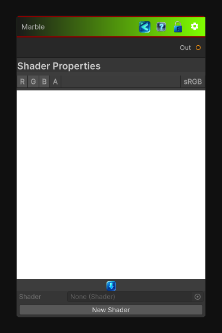

<link rel="stylesheet" href="../_assets/theme.css">

<button type="button" class="genesis-theme-toggle" data-genesis-theme-toggle aria-label="Toggle theme">Dark</button>

---
category: "Generators/Pattern"
---

# Marble

> Generates marble procedural noise.

## Description

Generates marble procedural noise.

Inputs:
- No external inputs. This node generates its output from its internal parameters.

Settings:
- No additional settings. This node is controlled by its built-in behavior.

Output:
- A generated procedural texture based on the node parameters.

## Inputs

| Name | Type | Description |
|------|------|-------------|

## Outputs

| Name | Type |
|------|------|

## Parameters

| Setting | Type | Default | Description |
|---------|------|---------|-------------|
| Scale | Range | 3 | Scale of the marble |
| Ratio | float | 1.0 | Length vs width ratio |
| Amplify Jitter | Enum | 1 | Amplify jittering of Voronoi |
| Perlin Effect | Enum | 1 | Level of effect of Perlin noise |
| Colorize | Enum | 0 | Will output in color for further processing |
| Seed | int | 52 | Controls the seed. |

## See Also

- [Back to Marble](./generators-index.md)
