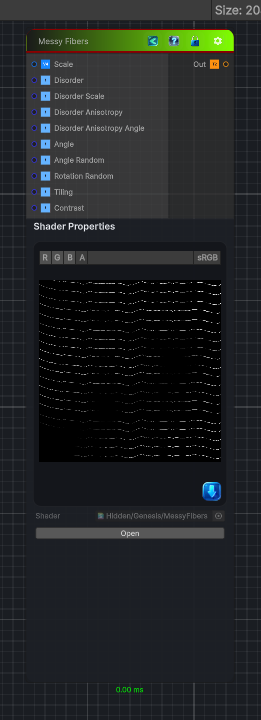

<link rel="stylesheet" href="../_assets/theme.css">

<button type="button" class="genesis-theme-toggle" data-genesis-theme-toggle aria-label="Toggle theme">Dark</button>

---
category: "Generators/Pattern"
---

# Messy Fibers

> Generates messy fibers 1 procedural noise.

## Description

Generates messy fibers 1 procedural noise.

Inputs:
- No external inputs. This node generates its output from its internal parameters.

Settings:
- No additional settings. This node is controlled by its built-in behavior.

Output:
- A generated procedural texture based on the node parameters.

## Inputs

| Name | Type | Description |
|------|------|-------------|
| Scale | Vector4 | Subdivision of grid for noise tiles |
| Disorder | Single | Displaces ingredients of noise |
| Disorder Scale | Single | Distance of displacement applied by Disorder |
| Disorder Anisotropy | Single | Span of directions for displacement, higher narrower |
| Disorder Anisotropy Angle | Single | Direction of displacement (turns, 0 right) |
| Angle | Single | Direction of threads (turns, 0 horizontal right) |
| Angle Random | Single | Random variation of angle |
| Rotation Random | Single | Random rotation of fiber lanes |
| Tiling | Single | Tiling applied to threads, higher is denser, thinner |
| Contrast | Single | Contrast brightness |

## Outputs

| Name | Type |
|------|------|
| Out | Texture2D |

## Parameters

| Setting | Type | Default | Description |
|---------|------|---------|-------------|
| nodeVariables | VariableStorage | AhahGames.GenesisNoise.Graph.VariableStorage | |
| GUID | String | aaf73f02-0c1c-4022-9ca8-1a78314cba17 | |
| expanded | Boolean | False | |

## See Also

- [Back to Messy Fibers](./generators-index.md)
