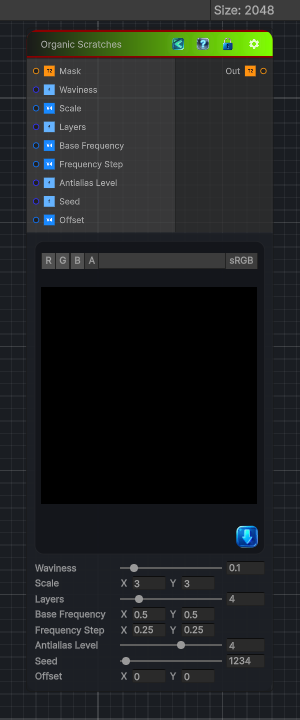

<link rel="stylesheet" href="../_assets/theme.css">

<button type="button" class="genesis-theme-toggle" data-genesis-theme-toggle aria-label="Toggle theme">Dark</button>

---
category: "Generators/Pattern"
---

# Organic Scratches

> Generates organic scratches procedural noise.

## Description

Generates organic scratches procedural noise.

Inputs:
- No external inputs. This node generates its output from its internal parameters.

Settings:
- No additional settings. This node is controlled by its built-in behavior.

Output:
- A generated procedural texture based on the node parameters.

## Inputs

| Name | Type | Description |
|------|------|-------------|
| Mask | Texture2D |  |
| Waviness | Single | Waviness of the scratches |
| Scale | Vector4 |  |
| Layers | Single |  |
| Base Frequency | Vector4 |  |
| Frequency Step | Vector4 |  |
| Antialias Level | Single |  |
| Seed | Single |  |
| Offset | Vector4 |  |

## Outputs

| Name | Type |
|------|------|
| Out | Texture2D |

## Parameters

| Setting | Type | Default | Description |
|---------|------|---------|-------------|
| Seed | Vector2 | 1234 | Waviness of the scratches |

## See Also

- [Back to Organic Scratches](./generators-index.md)
