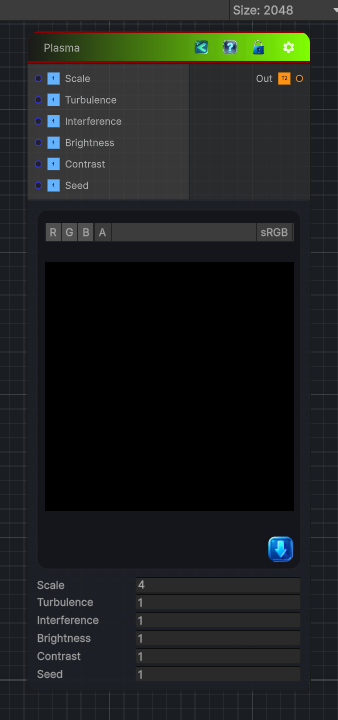

<link rel="stylesheet" href="../_assets/theme.css">

<button type="button" class="genesis-theme-toggle" data-genesis-theme-toggle aria-label="Toggle theme">Dark</button>

---
category: "Generators/Pattern"
---

# Plasma

> Generates plasma procedural noise.

## Description

Generates plasma procedural noise.

Inputs:
- No external inputs. This node generates its output from its internal parameters.

Settings:
- No additional settings. This node is controlled by its built-in behavior.

Output:
- A generated procedural texture based on the node parameters.

## Inputs

| Name | Type | Description |
|------|------|-------------|
| Scale | Single | Global scale of the plasma pattern |
| Turbulence | Single | Turbulence strength |
| Interference | Single | Interference strength |
| Brightness | Single | Brightness |
| Contrast | Single | Contrast |
| Seed | Single | Random seed |

## Outputs

| Name | Type |
|------|------|
| Out | Texture2D |

## Parameters

| Setting | Type | Default | Description |
|---------|------|---------|-------------|
| Scale | Float | 4.0 | Global scale of the plasma pattern |
| Turbulence | Float | 1.0 | Turbulence strength |
| Interference | Float | 1.0 | Interference strength |
| Brightness | Float | 1.0 | Brightness |
| Contrast | Float | 1.0 | Contrast |
| Seed | Float | 1.0 | Random seed |

## See Also

- [Back to Plasma](./generators-index.md)
