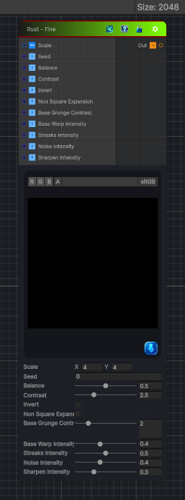

<link rel="stylesheet" href="../_assets/theme.css">

<button type="button" class="genesis-theme-toggle" data-genesis-theme-toggle aria-label="Toggle theme">Dark</button>

---
category: "Generators/Pattern"
---

# Rust - Fine

> Generates rust fine procedural noise.

## Description

Generates rust fine procedural noise.

Inputs:
- No external inputs. This node generates its output from its internal parameters.

Settings:
- No additional settings. This node is controlled by its built-in behavior.

Output:
- A generated procedural texture based on the node parameters.

## Inputs

| Name | Type | Description |
|------|------|-------------|
| Scale | Vector4 |  |
| Seed | Single |  |
| Balance | Single |  |
| Contrast | Single |  |
| Invert | Single |  |
| Non Square Expansion | Single |  |
| Base Grunge Contrast | Single |  |
| Base Warp Intensity | Single |  |
| Streaks Intensity | Single |  |
| Noise Intensity | Single |  |
| Sharpen Intensity | Single |  |

## Outputs

| Name | Type |
|------|------|
| Out | Texture2D |

## Parameters

| Setting | Type | Default | Description |
|---------|------|---------|-------------|
| Scale | Vector2 | (4,4,0,0) | Controls the scale. |
| Seed | Float | 0.0 | Controls the seed. |
| Balance | Range | 0.5 | Controls the balance. |
| Contrast | Range | 2.5 | Controls the contrast. |
| Invert | Toggle | 0 | Controls the invert. |
| Non Square Expansion | Toggle | 0 | Controls the non square expansion. |
| Base Grunge Contrast | Range | 2.0 | Controls the base grunge contrast. |
| Base Warp Intensity | Range | 0.4 | Controls the base warp intensity. |
| Streaks Intensity | Range | 0.5 | Controls the streaks intensity. |
| Noise Intensity | Range | 0.4 | Controls the noise intensity. |
| Sharpen Intensity | Range | 0.3 | Controls the sharpen intensity. |

## See Also

- [Back to Rust - Fine](./generators-index.md)
