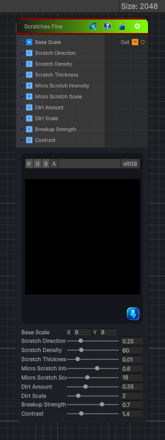

<link rel="stylesheet" href="../_assets/theme.css">

<button type="button" class="genesis-theme-toggle" data-genesis-theme-toggle aria-label="Toggle theme">Dark</button>

---
category: "Generators/Pattern"
---

# Scratches Fine

> Generates scratches fine procedural noise.

## Description

Generates scratches fine procedural noise.

Inputs:
- No external inputs. This node generates its output from its internal parameters.

Settings:
- No additional settings. This node is controlled by its built-in behavior.

Output:
- A generated procedural texture based on the node parameters.

## Inputs

| Name | Type | Description |
|------|------|-------------|
| Base Scale | Vector4 |  |
| Scratch Direction | Single |  |
| Scratch Density | Single |  |
| Scratch Thickness | Single |  |
| Micro Scratch Intensity | Single |  |
| Micro Scratch Scale | Single |  |
| Dirt Amount | Single |  |
| Dirt Scale | Single |  |
| Breakup Strength | Single |  |
| Contrast | Single |  |

## Outputs

| Name | Type |
|------|------|
| Out | Texture2D |

## Parameters

| Setting | Type | Default | Description |
|---------|------|---------|-------------|
| Base Scale | Vector2 | (8,8,0,0) | Controls the base scale. |
| Scratch Direction | Range | 0.25 | Controls the scratch direction. |
| Scratch Density | Range | 60.0 | Controls the scratch density. |
| Scratch Thickness | Range | 0.01 | Controls the scratch thickness. |
| Micro Scratch Intensity | Range | 0.6 | Controls the micro scratch intensity. |
| Micro Scratch Scale | Range | 18.0 | Controls the micro scratch scale. |
| Dirt Amount | Range | 0.35 | Controls the dirt amount. |
| Dirt Scale | Range | 2.0 | Controls the dirt scale. |
| Breakup Strength | Range | 0.7 | Controls the breakup strength. |
| Contrast | Range | 1.4 | Controls the contrast. |

## See Also

- [Back to Scratches Fine](./generators-index.md)
