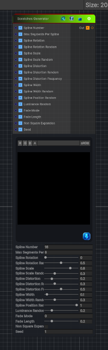

<link rel="stylesheet" href="../_assets/theme.css">

<button type="button" class="genesis-theme-toggle" data-genesis-theme-toggle aria-label="Toggle theme">Dark</button>

---
category: "Generators/Pattern"
---

# Scratches Generator

> Generates scratches procedural noise.

## Description

Generates scratches procedural noise.

Inputs:
- No external inputs. This node generates its output from its internal parameters.

Settings:
- No additional settings. This node is controlled by its built-in behavior.

Output:
- A generated procedural texture based on the node parameters.

## Inputs

| Name | Type | Description |
|------|------|-------------|
| Spline Number | Single | Amount of scratches splines to place (1 to 512) |
| Max Segments Per Spline | Single | Amount of segments per spline for smooth curves (2 to 256) |
| Spline Rotation | Single | Uniform rotation of all splines (0 to 1) |
| Spline Rotation Random | Single | Random rotation variation for each spline (0 to 1) |
| Spline Scale | Single | Uniform scale of all splines (0 to 1) |
| Spline Scale Random | Single | Random scale variation for each spline (0 to 1) |
| Spline Distortion | Single | Uniform distortion level (0 to 1) |
| Spline Distortion Random | Single | Random distortion for each spline (0 to 1) |
| Spline Distortion Frequency | Single | Scale of distortion detail (0 to 1) |
| Spline Width | Single | Uniform width of splines (0 to 2) |
| Spline Width Random | Single | Random width for each spline (0 to 1) |
| Spline Position Random | Single | Random positioning of splines (0 to 1) |
| Luminance Random | Single | Random brightness of each spline (0 to 1) |
| Fade Mode | Single | Fade mode 0 None, 1 Start, 2 End, 3 Start End |
| Fade Length | Single | Length of fade effect (0 to 1) |
| Non Square Expansion | Single | Enable non square aspect ratio compensation |
| Seed | Single | Random seed |

## Outputs

| Name | Type |
|------|------|
| Out | Texture2D |

## Parameters

| Setting | Type | Default | Description |
|---------|------|---------|-------------|
| Spline Number | Int | 16 | Amount of scratches splines to place (1 to 512) |
| Max Segments Per Spline | Int | 8 | Amount of segments per spline for smooth curves (2 to 256) |
| Spline Rotation | Range | 0.0 | Uniform rotation of all splines (0 to 1) |
| Spline Rotation Random | Range | 0.5 | Random rotation variation for each spline (0 to 1) |
| Spline Scale | Range | 0.8 | Uniform scale of all splines (0 to 1) |
| Spline Scale Random | Range | 0.3 | Random scale variation for each spline (0 to 1) |
| Spline Distortion | Range | 0.2 | Uniform distortion level (0 to 1) |
| Spline Distortion Random | Range | 0.3 | Random distortion for each spline (0 to 1) |
| Spline Distortion Frequency | Range | 0.5 | Scale of distortion detail (0 to 1) |
| Spline Width | Range | 0.1 | Uniform width of splines (0 to 2) |
| Spline Width Random | Range | 0.3 | Random width for each spline (0 to 1) |
| Spline Position Random | Range | 1.0 | Random positioning of splines (0 to 1) |
| Luminance Random | Range | 0.2 | Random brightness of each spline (0 to 1) |
| Fade Mode | Int | 0 | Fade mode 0 None, 1 Start, 2 End, 3 Start End |
| Fade Length | Range | 0.2 | Length of fade effect (0 to 1) |
| Non Square Expansion | Toggle | 0.0 | Enable non square aspect ratio compensation |
| Seed | Float | 1.0 | Random seed |

## See Also

- [Back to Scratches Generator](./generators-index.md)
