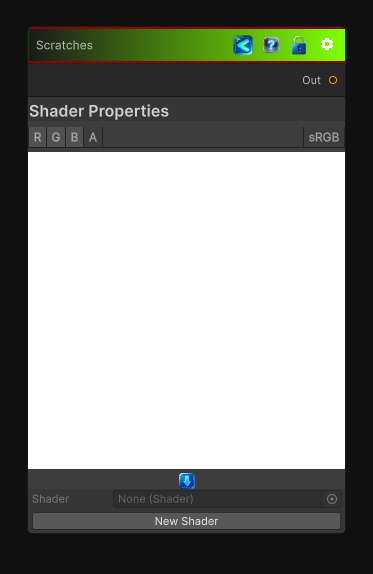

<link rel="stylesheet" href="../_assets/theme.css">

<button type="button" class="genesis-theme-toggle" data-genesis-theme-toggle aria-label="Toggle theme">Dark</button>

---
category: "Generators/Pattern"
---

# Scratches

> Generates scratches procedural noise.

## Description

Generates scratches procedural noise.

Inputs:
- No external inputs. This node generates its output from its internal parameters.

Settings:
- No additional settings. This node is controlled by its built-in behavior.

Output:
- A generated procedural texture based on the node parameters.

## Inputs

| Name | Type | Description |
|------|------|-------------|

## Outputs

| Name | Type |
|------|------|

## Parameters

| Setting | Type | Default | Description |
|---------|------|---------|-------------|
| Use Mask | Enum | 1 | Enable scratch mask texture |
| Density | Range | 15 | Density of scraches, over 0..2 is recommended |
| Angle | Range | 0.0 | The angle in radians of the scratches |
| Min Thickness | Range | 0.01 | Minimum thickness. Hairline to gouge (In UV units after scaling) |
| Max Thickness | Range | 0.1 | Maximum thickness. Hairline to gouge (In UV units after scaling) |
| Min Length | Range | 0.1 | Minimum length of a scratch |
| Max Length | Range | 0.5 | Maximum length of a scratch |
| Curvature Mode | Enum | 0 | Curvature mode of the scratches.  None makes straight scratches |
| Parabolic Factor | Range | 0.100 | Parabolic curvature factor |
| Radial Scale | Range | 0.100 | Radial curvature scale, defines how many arcs |
| Radial Center | Vector2 | (0.5, 0.5, 0, 0) | UV Center of the arcs |
| Dash Length | Range | 0.100 | Units along line direction, UV units |
| Gap Size | Range | 0.050 | Gap size, UV units |
| Dash Softness | Range | 0.05 | Sets the softness of the edge |
| Dash jitter | Range | 0.075 | Per stripe random phase jitter |
| Intensity | Range | 0.5 | Defines the mixture intensity |
| Color | Color | (0.7, 0.7, 0.7, 1) | The color of the scratches |
| Seed | int | 52 | Randomization seed |

## See Also

- [Back to Scratches](./generators-index.md)
