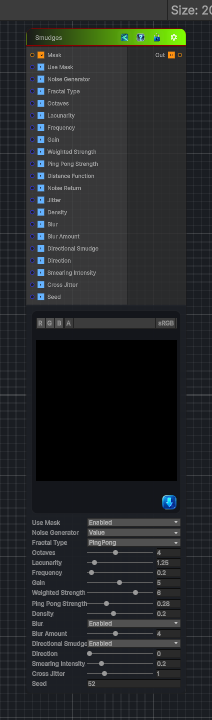

<link rel="stylesheet" href="../_assets/theme.css">

<button type="button" class="genesis-theme-toggle" data-genesis-theme-toggle aria-label="Toggle theme">Dark</button>

---
category: "Generators/Pattern"
---

# Smudges

> Generates smudges procedural noise.

## Description

Generates smudges procedural noise.

Inputs:
- No external inputs. This node generates its output from its internal parameters.

Settings:
- No additional settings. This node is controlled by its built-in behavior.

Output:
- A generated procedural texture based on the node parameters.

## Inputs

| Name | Type | Description |
|------|------|-------------|
| Mask | Texture2D |  |
| Use Mask | Single | Enable scratch mask texture |
| Noise Generator | Single | Noise generator for smudges |
| Fractal Type | Single | Fractal type for noise, PingPong tends to make islands which are a good starting point for smudging |
| Octaves | Single | Octaves of noise |
| Lacunarity | Single | Lacunarity of noise |
| Frequency | Single | Frequency of noise, use lower values for realistic smudging except with Value generator, larger values are required |
| Gain | Single | Gain of the noise, recommneded to use values higher than 1 to create larger smudges |
| Weighted Strength | Single | Weighted strength pushes the noise towards islands, very good for a smudging effect.  A side effect is that the smudges lose value variety at higher levels as they end up maxed at 1.0 |
| Ping Pong Strength | Single | Ping Pong strength increases the values across the noise.  Lower levels will create more islands, higher levels will fill in the noise completely |
| Distance Function | Single | Various distance functions for defining cellular noise |
| Noise Return | Single | Return value of the noise function.  This has a fairly dramatic effect on the value, experiment or see the documentation for examples |
| Jitter | Single | Jitter introduces more randomness to the noise, lower values result in fewer artifacts and more order |
| Density | Single | Density of smudges, 0.1 to 0.2 is recommended |
| Blur | Single | Post generation blur.  This will smooth out the edges |
| Blur Amount | Single | Amount of blur, higher values are more expensive |
| Directional Smudge | Single | Push smudges in a direction |
| Direction | Single | Direction of smudges in radians |
| Smearing Intensity | Single | Smearing intensity 0..1, pushes and blurs the smudge to the direction defined above |
| Cross Jitter | Single | Cross jitter adds an amount of randomness perpendicular to the direction |
| Seed | Single | Seed for the noise generator |

## Outputs

| Name | Type |
|------|------|
| Out | Texture2D |

## Parameters

| Setting | Type | Default | Description |
|---------|------|---------|-------------|
| Use Mask | Enum | 1 | Enable scratch mask texture |
| Noise Generator | Enum | 0 | Noise generator for smudges |
| Fractal Type | Enum | 0 | Fractal type for noise, PingPong tends to make islands which are a good starting point for smudging |
| Octaves | Range | 4 | Octaves of noise |
| Lacunarity | Range | 1.25 | Lacunarity of noise |
| Frequency | Range | .20 | Frequency of noise, use lower values for realistic smudging except with Value generator, larger values are required |
| Gain | Range | 5.0 | Gain of the noise, recommneded to use values higher than 1 to create larger smudges |
| Weighted Strength | Range | 6.0 | Weighted strength pushes the noise towards islands, very good for a smudging effect.  A side effect is that the smudges lose value variety at higher levels as they end up maxed at 1.0 |
| Ping Pong Strength | Range | 0.280 | Ping Pong strength increases the values across the noise.  Lower levels will create more islands, higher levels will fill in the noise completely |
| Distance Function | Enum | 0 | Various distance functions for defining cellular noise |
| Noise Return | int | 4 | Return value of the noise function.  This has a fairly dramatic effect on the value, experiment or see the documentation for examples |
| Jitter | Range | 1.6 | Jitter introduces more randomness to the noise, lower values result in fewer artifacts and more order |
| Density | Range | 0.2 | Density of smudges, 0.1 to 0.2 is recommended |
| Blur | Enum | 1 | Post generation blur.  This will smooth out the edges |
| Blur Amount | Range | 4 | Amount of blur, higher values are more expensive |
| Directional Smudge | Enum | 1 | Push smudges in a direction |
| Direction | Range | 0.0 | Direction of smudges in radians |
| Smearing Intensity | Range | 0.2 | Smearing intensity 0..1, pushes and blurs the smudge to the direction defined above |
| Cross Jitter | Range | 1.0 | Cross jitter adds an amount of randomness perpendicular to the direction |
| Seed | Int | 52 | Seed for the noise generator |

## See Also

- [Back to Smudges](./generators-index.md)
