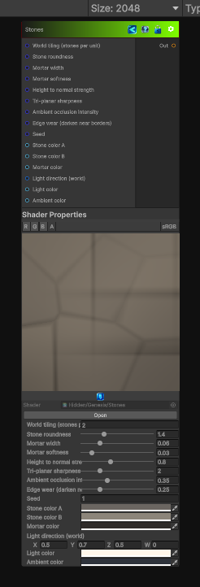

<link rel="stylesheet" href="../_assets/theme.css">

<button type="button" class="genesis-theme-toggle" data-genesis-theme-toggle aria-label="Toggle theme">Dark</button>

---
category: "Generators/Pattern"
---

# Stones

> Generates stones procedural noise.

## Description

Generates stones procedural noise.

Inputs:
- No external inputs. This node generates its output from its internal parameters.

Settings:
- No additional settings. This node is controlled by its built-in behavior.

Output:
- A generated procedural texture based on the node parameters.

## Inputs

| Name | Type | Description |
|------|------|-------------|

## Outputs

| Name | Type |
|------|------|

## Parameters

| Setting | Type | Default | Description |
|---------|------|---------|-------------|
| World tiling (stones per unit) | Float | 2.0 | Controls the world tiling (stones per unit). |
| Stone roundness | Range | 1.4 | Controls the stone roundness. |
| Mortar width | Range | 0.06 | Controls the mortar width. |
| Mortar softness | Range | 0.03 | Controls the mortar softness. |
| Height to normal strength | Range | 0.8 | Controls the height to normal strength. |
| Tri-planar sharpness | Range | 2.0 | Controls the tri-planar sharpness. |
| Ambient occlusion intensity | Range | 0.35 | Controls the ambient occlusion intensity. |
| Edge wear (darken near borders) | Range | 0.25 | Controls the edge wear (darken near borders). |
| Seed | Float | 1.0 | Controls the seed. |
| Stone color A | Color | (0.42, 0.40, 0.38, 1) | Controls the stone color a. |
| Stone color B | Color | (0.55, 0.52, 0.48, 1) | Controls the stone color b. |
| Mortar color | Color | (0.18, 0.17, 0.16, 1) | Controls the mortar color. |
| Light direction (world) | Vector | (0.5, 0.7, 0.5, 0) | Controls the light direction (world). |
| Light color | Color | (1, 0.97, 0.92, 1) | Controls the light color. |
| Ambient color | Color | (0.18, 0.2, 0.23, 1) | Controls the ambient color. |

## See Also

- [Back to Stones](./generators-index.md)
