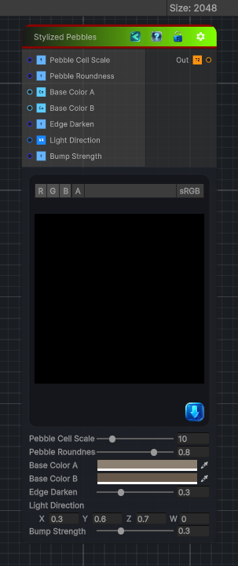

<link rel="stylesheet" href="../_assets/theme.css">

<button type="button" class="genesis-theme-toggle" data-genesis-theme-toggle aria-label="Toggle theme">Dark</button>

---
category: "Generators/Pattern"
---

# Stylized Pebbles

> Generates stylized pebbles procedural noise.

## Description

Generates stylized pebbles procedural noise.

Inputs:
- No external inputs. This node generates its output from its internal parameters.

Settings:
- No additional settings. This node is controlled by its built-in behavior.

Output:
- A generated procedural texture based on the node parameters.

## Inputs

| Name | Type | Description |
|------|------|-------------|
| Pebble Cell Scale | Single |  |
| Pebble Roundness | Single |  |
| Base Color A | Color |  |
| Base Color B | Color |  |
| Edge Darken | Single |  |
| Light Direction | Vector4 |  |
| Bump Strength | Single |  |

## Outputs

| Name | Type |
|------|------|
| Out | Texture2D |

## Parameters

| Setting | Type | Default | Description |
|---------|------|---------|-------------|
| Pebble Cell Scale | Range | 10 | Controls the pebble cell scale. |
| Pebble Roundness | Range | 0.8 | Controls the pebble roundness. |
| Base Color A | Color | (0.55, 0.5, 0.45, 1) | Controls the base color a. |
| Base Color B | Color | (0.4, 0.35, 0.3, 1) | Controls the base color b. |
| Edge Darken | Range | 0.3 | Controls the edge darken. |
| Light Direction | Vector | (0.3, 0.6, 0.7, 0) | Controls the light direction. |
| Bump Strength | Range | 0.3 | Controls the bump strength. |

## See Also

- [Back to Stylized Pebbles](./generators-index.md)
