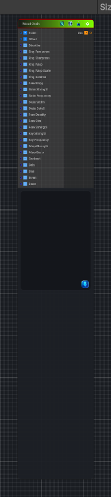

<link rel="stylesheet" href="../_assets/theme.css">

<button type="button" class="genesis-theme-toggle" data-genesis-theme-toggle aria-label="Toggle theme">Dark</button>

---
category: "Generators/Pattern"
---

# Wood Grain

> Generates wood grain procedural noise.

## Description

Generates wood grain procedural noise.

Inputs:
- No external inputs. This node generates its output from its internal parameters.

Settings:
- No additional settings. This node is controlled by its built-in behavior.

Output:
- A generated procedural texture based on the node parameters.

## Inputs

| Name | Type | Description |
|------|------|-------------|
| Scale | Vector4 | Global UV scale |
| Offset | Vector4 | Global UV offset |
| Direction | Single | Wood axis direction in radians |
| Ring Frequency | Single | Base ring frequency |
| Ring Sharpness | Single | Ring contrast sharpness |
| Ring Warp | Single | Ring irregularity amount |
| Ring Warp Scale | Single | Ring noise scale |
| Ring Balance | Single | Earlywood latewood balance |
| Anisotropy | Single | Long fiber anisotropy |
| Grain Strength | Single | Long grain intensity |
| Grain Frequency | Single | Fiber frequency |
| Grain Width | Single | Fiber width |
| Grain Detail | Single | Fiber detail amount |
| Pore Density | Single | Pore density |
| Pore Size | Single | Pore size |
| Pore Strength | Single | Pore contrast |
| Ray Strength | Single | Wood ray intensity |
| Ray Frequency | Single | Wood ray frequency |
| Warp Strength | Single | Global domain warp strength |
| Warp Scale | Single | Global domain warp scale |
| Contrast | Single | Final contrast |
| Gain | Single | Final gain |
| Bias | Single | Final bias |
| Invert | Single | Invert output |
| Seed | Single | Random seed |

## Outputs

| Name | Type |
|------|------|
| Out | Texture2D |

## Parameters

| Setting | Type | Default | Description |
|---------|------|---------|-------------|
| Scale | Vector | (8,8,0,0) | Global UV scale |
| Offset | Vector | (0,0,0,0) | Global UV offset |
| Direction | Range | 0.0 | Wood axis direction in radians |
| Ring Frequency | Range | 14.0 | Base ring frequency |
| Ring Sharpness | Range | 4.0 | Ring contrast sharpness |
| Ring Warp | Range | 0.75 | Ring irregularity amount |
| Ring Warp Scale | Range | 3.0 | Ring noise scale |
| Ring Balance | Range | 0.55 | Earlywood latewood balance |
| Anisotropy | Range | 12.0 | Long fiber anisotropy |
| Grain Strength | Range | 0.8 | Long grain intensity |
| Grain Frequency | Range | 24.0 | Fiber frequency |
| Grain Width | Range | 2.2 | Fiber width |
| Grain Detail | Range | 0.6 | Fiber detail amount |
| Pore Density | Range | 38.0 | Pore density |
| Pore Size | Range | 0.18 | Pore size |
| Pore Strength | Range | 0.45 | Pore contrast |
| Ray Strength | Range | 0.25 | Wood ray intensity |
| Ray Frequency | Range | 12.0 | Wood ray frequency |
| Warp Strength | Range | 0.25 | Global domain warp strength |
| Warp Scale | Range | 2.0 | Global domain warp scale |
| Contrast | Range | 1.2 | Final contrast |
| Gain | Range | 1.0 | Final gain |
| Bias | Range | 0.0 | Final bias |
| Invert | Range | 0 | Invert output |
| Seed | int | 1 | Random seed |

## See Also

- [Back to Wood Grain](./generators-index.md)
