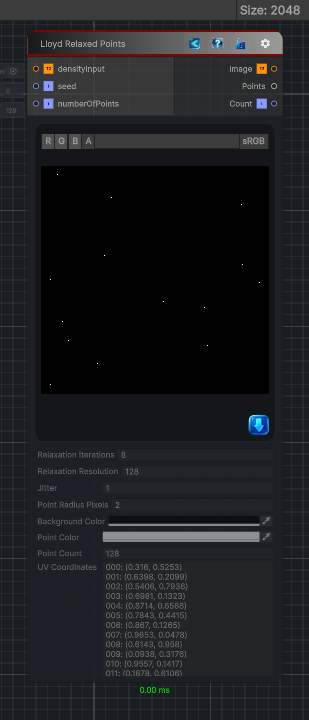

<link rel="stylesheet" href="../_assets/theme.css">

<button type="button" class="genesis-theme-toggle" data-genesis-theme-toggle aria-label="Toggle theme">Dark</button>

---
category: "Generators/Points"
---

# Lloyd Relaxed Points

> Generates lloyd relaxed points data for point-based procedural workflows.

## Description

Generates lloyd relaxed points data for point-based procedural workflows.

Inputs:
- densityInput (Texture): Connected input value used to control the generated result.
- seed (int): Connected input value used to control the generated result.
- numberOfPoints (int): Connected input value used to control the generated result.

Settings:
- relaxationIterations: Sets the number of relaxation iterations used by the generator.
- relaxationResolution: Controls the relaxation resolution used by the generator.
- jitter: Controls the jitter used by the generator.
- pointRadiusPixels: Sets the pixel radius used when drawing each generated point.
- backgroundColor: Sets the background color behind the generated result.
- pointColor: Sets the color used for generated points.

Output:
- A point image, the relaxed point list, and the point count.

## Inputs

| Name | Type | Description |
|------|------|-------------|
| numberOfPoints | Int32 |  |
| seed | Int32 |  |
| densityInput | Texture2D |  |

## Outputs

| Name | Type |
|------|------|
| Count | Int32 |
| Points | List`1 |
| Image | Texture2D |

## Parameters

| Setting | Type | Default | Description |
|---------|------|---------|-------------|
| relaxationIterations | Int32 | 8 | |
| relaxationResolution | Int32 | 128 | |
| jitter | Single | 1 | |
| pointRadiusPixels | Int32 | 2 | |
| backgroundColor | Color | RGBA(0.000, 0.000, 0.000, 1.000) | |
| pointColor | Color | RGBA(1.000, 1.000, 1.000, 1.000) | |
| nodeVariables | VariableStorage | AhahGames.GenesisNoise.Graph.VariableStorage | |
| GUID | String | 57333cf4-624a-4f3e-95ed-fc1367be8ad2 | |
| expanded | Boolean | False | |

## See Also

- [Back to Lloyd Relaxed Points](./generators-index.md)
