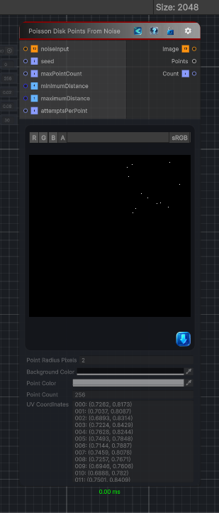

<link rel="stylesheet" href="../_assets/theme.css">

<button type="button" class="genesis-theme-toggle" data-genesis-theme-toggle aria-label="Toggle theme">Dark</button>

---
category: "Generators/Points"
---

# Poisson Disk Points From Noise

> Generates noise scaled poisson disk points data for point-based procedural workflows.

## Description

Generates noise scaled poisson disk points data for point-based procedural workflows.

Inputs:
- noiseInput (Texture): Connected input value used to control the generated result.
- seed (int): Connected input value used to control the generated result.
- maxPointCount (int): Connected input value used to control the generated result.
- minimumDistance (float): Connected input value used to control the generated result.
- maximumDistance (float): Connected input value used to control the generated result.
- attemptsPerPoint (int): Connected input value used to control the generated result.

Settings:
- pointRadiusPixels: Sets the pixel radius used when drawing each generated point.
- backgroundColor: Sets the background color behind the generated result.
- pointColor: Sets the color used for generated points.

Output:
- A point image, the generated point list, and the point count.

## Inputs

| Name | Type | Description |
|------|------|-------------|

## Outputs

| Name | Type |
|------|------|

## Parameters

| Setting | Type | Default | Description |
|---------|------|---------|-------------|
| pointRadiusPixels | Int32 | 2 | |
| backgroundColor | Color | RGBA(0.000, 0.000, 0.000, 1.000) | |
| pointColor | Color | RGBA(1.000, 1.000, 1.000, 1.000) | |
| nodeVariables | VariableStorage | AhahGames.GenesisNoise.Graph.VariableStorage | |
| GUID | String | a92a9235-f93b-42ba-af66-d13026970732 | |
| expanded | Boolean | False | |

## See Also

- [Back to Poisson Disk Points From Noise](./generators-index.md)
