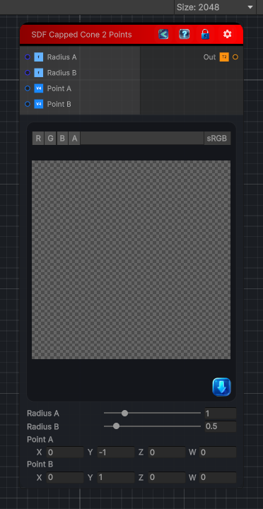

<link rel="stylesheet" href="../_assets/theme.css">

<button type="button" class="genesis-theme-toggle" data-genesis-theme-toggle aria-label="Toggle theme">Dark</button>

---
category: "Generators/SDF Primitives"
---

# Capped Cone (2 Points)

> Computes the signed distance field for a SDF Capped Cone 2 Points primitive.

## Description

Computes the signed distance field for a SDF Capped Cone 2 Points primitive.

## Inputs

| Name | Type | Description |
|------|------|-------------|
| Radius A | Single | Radius at the first point. |
| Radius B | Single | Radius at the second point. |
| Point A | Vector4 | First point position. |
| Point B | Vector4 | Second point position. |

## Outputs

| Name | Type |
|------|------|
| Out | Texture2D |

## Parameters

| Setting | Type | Default | Description |
|---------|------|---------|-------------|
| Radius A | Range | 1.0 | Radius at the first point. |
| Radius B | Range | 0.5 | Radius at the second point. |
| Point A | Vector | (0, -1, 0, 0) | First point position. |
| Point B | Vector | (0, 1, 0, 0) | Second point position. |

## See Also

- [Back to Capped Cone (2 Points)](./generators-index.md)
