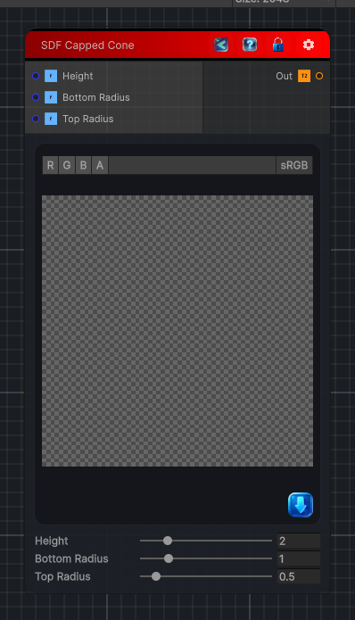

<link rel="stylesheet" href="../_assets/theme.css">

<button type="button" class="genesis-theme-toggle" data-genesis-theme-toggle aria-label="Toggle theme">Dark</button>

---
category: "Generators/SDF Primitives"
---

# Capped Cone

> Computes the signed distance field for a SDF Capped Cone primitive.

## Description

Computes the signed distance field for a SDF Capped Cone primitive.

## Inputs

| Name | Type | Description |
|------|------|-------------|
| Height | Single | Height of the cone. |
| Bottom Radius | Single | Radius of the bottom cap. |
| Top Radius | Single | Radius of the top cap. |

## Outputs

| Name | Type |
|------|------|
| Out | Texture2D |

## Parameters

| Setting | Type | Default | Description |
|---------|------|---------|-------------|
| Height | Range | 2.0 | Height of the cone. |
| Bottom Radius | Range | 1.0 | Radius of the bottom cap. |
| Top Radius | Range | 0.5 | Radius of the top cap. |

## See Also

- [Back to Capped Cone](./generators-index.md)
