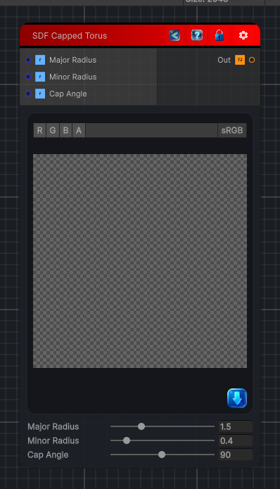

<link rel="stylesheet" href="../_assets/theme.css">

<button type="button" class="genesis-theme-toggle" data-genesis-theme-toggle aria-label="Toggle theme">Dark</button>

---
category: "Generators/SDF Primitives"
---

# Capped Torus

> Computes the signed distance field for a SDF Capped Torus primitive.

## Description

Computes the signed distance field for a SDF Capped Torus primitive.

## Inputs

| Name | Type | Description |
|------|------|-------------|
| Major Radius | Single | Major radius of the torus. |
| Minor Radius | Single | Minor radius (thickness) of the torus. |
| Cap Angle | Single | Angle of the cap in degrees. |

## Outputs

| Name | Type |
|------|------|
| Out | Texture2D |

## Parameters

| Setting | Type | Default | Description |
|---------|------|---------|-------------|
| Major Radius | Range | 1.5 | Major radius of the torus. |
| Minor Radius | Range | 0.4 | Minor radius (thickness) of the torus. |
| Cap Angle | Range | 90.0 | Angle of the cap in degrees. |

## See Also

- [Back to Capped Torus](./generators-index.md)
