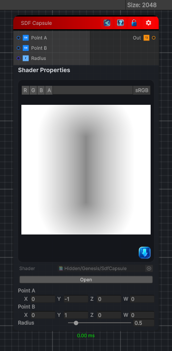

<link rel="stylesheet" href="../_assets/theme.css">

<button type="button" class="genesis-theme-toggle" data-genesis-theme-toggle aria-label="Toggle theme">Dark</button>

---
category: "Generators/SDF Primitives"
---

# Capsule

> Computes the signed distance field for a capsule between two points.

## Description

Computes the signed distance field for a capsule between two points.

## Inputs

| Name | Type | Description |
|------|------|-------------|
| Point A | Vector4 |  |
| Point B | Vector4 |  |
| Radius | Single |  |

## Outputs

| Name | Type |
|------|------|
| Out | Texture2D |

## Parameters

| Setting | Type | Default | Description |
|---------|------|---------|-------------|
| nodeVariables | VariableStorage | AhahGames.GenesisNoise.Graph.VariableStorage | |
| GUID | String | 6fdc23dd-2221-4455-b94f-82d02921569c | |
| expanded | Boolean | False | |

## See Also

- [Back to Capsule](./generators-index.md)
