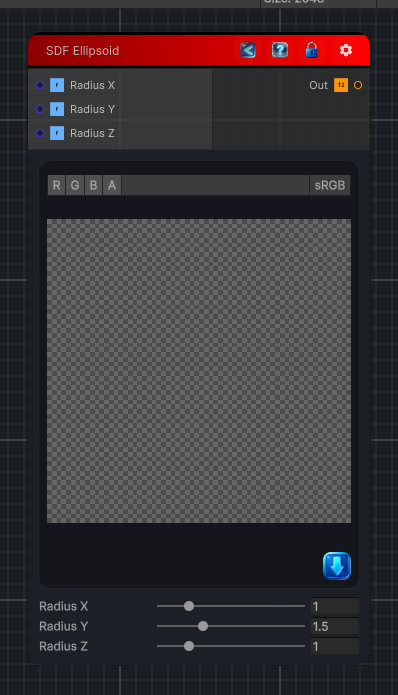

<link rel="stylesheet" href="../_assets/theme.css">

<button type="button" class="genesis-theme-toggle" data-genesis-theme-toggle aria-label="Toggle theme">Dark</button>

---
category: "Generators/SDF Primitives"
---

# Ellipsoid

> Computes the signed distance field for a SDF Ellipsoid primitive.

## Description

Computes the signed distance field for a SDF Ellipsoid primitive.

## Inputs

| Name | Type | Description |
|------|------|-------------|
| Radius X | Single | Radius along the X axis. |
| Radius Y | Single | Radius along the Y axis. |
| Radius Z | Single | Radius along the Z axis. |

## Outputs

| Name | Type |
|------|------|
| Out | Texture2D |

## Parameters

| Setting | Type | Default | Description |
|---------|------|---------|-------------|
| Radius X | Range | 1.0 | Radius along the X axis. |
| Radius Y | Range | 1.5 | Radius along the Y axis. |
| Radius Z | Range | 1.0 | Radius along the Z axis. |

## See Also

- [Back to Ellipsoid](./generators-index.md)
