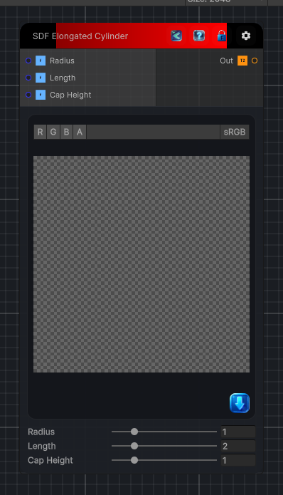

<link rel="stylesheet" href="../_assets/theme.css">

<button type="button" class="genesis-theme-toggle" data-genesis-theme-toggle aria-label="Toggle theme">Dark</button>

---
category: "Generators/SDF Primitives"
---

# Elongated Cylinder

> Computes the signed distance field for a SDF Elongated Cylinder primitive.

## Description

Computes the signed distance field for a SDF Elongated Cylinder primitive.

## Inputs

| Name | Type | Description |
|------|------|-------------|

## Outputs

| Name | Type |
|------|------|

## Parameters

| Setting | Type | Default | Description |
|---------|------|---------|-------------|
| Radius | Range | 1.0 | Radius of the cylinder. |
| Length | Range | 2.0 | Length of the cylindrical section. |
| Cap Height | Range | 1.0 | Height of the end caps. |

## See Also

- [Back to Elongated Cylinder](./generators-index.md)
