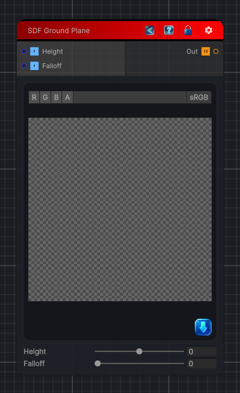

<link rel="stylesheet" href="../_assets/theme.css">

<button type="button" class="genesis-theme-toggle" data-genesis-theme-toggle aria-label="Toggle theme">Dark</button>

---
category: "Generators/SDF Primitives"
---

# Ground Plane

> Computes the signed distance field for a SDF Ground Plane primitive.

## Description

Computes the signed distance field for a SDF Ground Plane primitive.

## Inputs

| Name | Type | Description |
|------|------|-------------|
| Height | Single | Height of the ground plane along Y. |
| Falloff | Single | Soft falloff distance from the plane. |

## Outputs

| Name | Type |
|------|------|
| Out | Texture2D |

## Parameters

| Setting | Type | Default | Description |
|---------|------|---------|-------------|
| Height | Range | 0.0 | Height of the ground plane along Y. |
| Falloff | Range | 0.0 | Soft falloff distance from the plane. |

## See Also

- [Back to Ground Plane](./generators-index.md)
