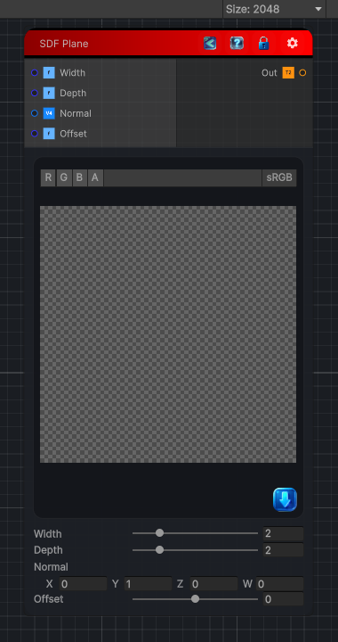

<link rel="stylesheet" href="../_assets/theme.css">

<button type="button" class="genesis-theme-toggle" data-genesis-theme-toggle aria-label="Toggle theme">Dark</button>

---
category: "Generators/SDF Primitives"
---

# Plane

> Computes the signed distance field for a SDF Plane primitive.

## Description

Computes the signed distance field for a SDF Plane primitive.

## Inputs

| Name | Type | Description |
|------|------|-------------|
| Width | Single | Width of the plane (X axis). |
| Depth | Single | Depth of the plane (Z axis). |
| Normal | Vector4 | Normal direction of the plane. |
| Offset | Single | Offset distance along the normal. |

## Outputs

| Name | Type |
|------|------|
| Out | Texture2D |

## Parameters

| Setting | Type | Default | Description |
|---------|------|---------|-------------|
| Width | Range | 2.0 | Width of the plane (X axis). |
| Depth | Range | 2.0 | Depth of the plane (Z axis). |
| Normal | Vector | (0, 1, 0, 0) | Normal direction of the plane. |
| Offset | Range | 0.0 | Offset distance along the normal. |

## See Also

- [Back to Plane](./generators-index.md)
