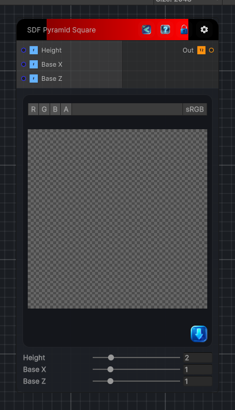

<link rel="stylesheet" href="../_assets/theme.css">

<button type="button" class="genesis-theme-toggle" data-genesis-theme-toggle aria-label="Toggle theme">Dark</button>

---
category: "Generators/SDF Primitives"
---

# Pyramid Square

> Computes the signed distance field for a SDF Pyramid Square primitive.

## Description

Computes the signed distance field for a SDF Pyramid Square primitive.

## Inputs

| Name | Type | Description |
|------|------|-------------|

## Outputs

| Name | Type |
|------|------|

## Parameters

| Setting | Type | Default | Description |
|---------|------|---------|-------------|
| Height | Range | 2.0 | Height of the pyramid. |
| Base X | Range | 1.0 | Half width of the base along X. |
| Base Z | Range | 1.0 | Half width of the base along Z. |

## See Also

- [Back to Pyramid Square](./generators-index.md)
