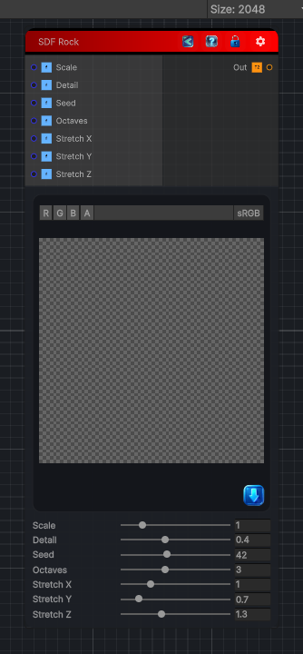

<link rel="stylesheet" href="../_assets/theme.css">

<button type="button" class="genesis-theme-toggle" data-genesis-theme-toggle aria-label="Toggle theme">Dark</button>

---
category: "Generators/SDF Primitives"
---

# Rock

> Computes the signed distance field for a SDF Rock primitive.

## Description

Computes the signed distance field for a SDF Rock primitive.

## Inputs

| Name | Type | Description |
|------|------|-------------|
| Scale | Single | Overall scale of the rock. |
| Detail | Single | Amount of surface deformation. |
| Seed | Single | Seed for the random shape. |
| Octaves | Single | Number of noise octaves. |
| Stretch X | Single | Stretch along X. |
| Stretch Y | Single | Stretch along Y. |
| Stretch Z | Single | Stretch along Z. |

## Outputs

| Name | Type |
|------|------|
| Out | Texture2D |

## Parameters

| Setting | Type | Default | Description |
|---------|------|---------|-------------|
| Scale | Range | 1.0 | Overall scale of the rock. |
| Detail | Range | 0.4 | Amount of surface deformation. |
| Seed | Range | 42.0 | Seed for the random shape. |
| Octaves | Range | 3 | Number of noise octaves. |
| Stretch X | Range | 1.0 | Stretch along X. |
| Stretch Y | Range | 0.7 | Stretch along Y. |
| Stretch Z | Range | 1.3 | Stretch along Z. |

## See Also

- [Back to Rock](./generators-index.md)
