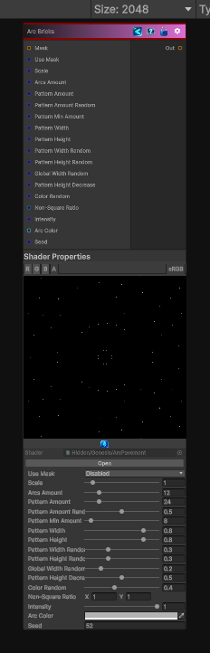

<link rel="stylesheet" href="../_assets/theme.css">

<button type="button" class="genesis-theme-toggle" data-genesis-theme-toggle aria-label="Toggle theme">Dark</button>

---
category: "Generators/Shapes"
---

# Arc Bricks

> Generates arc bricks procedural noise.

## Description

Generates arc bricks procedural noise.

Inputs:
- No external inputs. This node generates its output from its internal parameters.

Settings:
- No additional settings. This node is controlled by its built-in behavior.

Output:
- A generated procedural texture based on the node parameters.

## Inputs

| Name | Type | Description |
|------|------|-------------|

## Outputs

| Name | Type |
|------|------|

## Parameters

| Setting | Type | Default | Description |
|---------|------|---------|-------------|
| Use Mask | Enum | 0 | Enable mask texture |
| Scale | Range | 1.0 | Global tiling |
| Arcs Amount | Range | 12 | Number of concentric arcs |
| Pattern Amount | Range | 24 | Base bricks per arc |
| Pattern Amount Random | Range | 0.5 | Randomization of bricks per arc |
| Pattern Min Amount | Range | 8 | Minimum bricks per arc |
| Pattern Width | Range | 0.8 | Angular brick size |
| Pattern Height | Range | 0.8 | Radial brick size |
| Pattern Width Random | Range | 0.3 | Per brick width random |
| Pattern Height Random | Range | 0.3 | Per brick height random |
| Global Width Random | Range | 0.2 | Global width random per arc |
| Pattern Height Decrease | Range | 0.5 | Height decrease at arc ends |
| Color Random | Range | 0.4 | Per brick color variation |
| Non-Square Ratio | Vector2 | (1, 1, 0, 0) | Non square compensation (x,y) |
| Intensity | Range | 1.0 | Height intensity of pattern |
| Arc Color | Color | (0.7, 0.7, 0.7, 1) | Base color of arcs |
| Seed | int | 52 | Randomization seed |

## See Also

- [Back to Arc Bricks](./generators-index.md)
