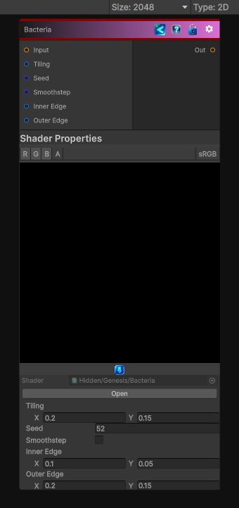

<link rel="stylesheet" href="../_assets/theme.css">

<button type="button" class="genesis-theme-toggle" data-genesis-theme-toggle aria-label="Toggle theme">Dark</button>

---
category: "Generators/Shapes"
---

# Bacteria

> Generates bacteria procedural noise.

## Description

Generates bacteria procedural noise.

Inputs:
- No external inputs. This node generates its output from its internal parameters.

Settings:
- No additional settings. This node is controlled by its built-in behavior.

Output:
- A generated procedural texture based on the node parameters.

## Inputs

| Name | Type | Description |
|------|------|-------------|

## Outputs

| Name | Type |
|------|------|

## Parameters

| Setting | Type | Default | Description |
|---------|------|---------|-------------|
| Input | 2D | white | Controls the input. |
| Tiling | Vector, 2 | (0.2, 0.15, 0, 0) | Controls the tiling. |
| Seed | Float | 52 | Controls the seed. |
| Smoothstep | Float | 0 | Controls the smoothstep. |

## See Also

- [Back to Bacteria](./generators-index.md)
