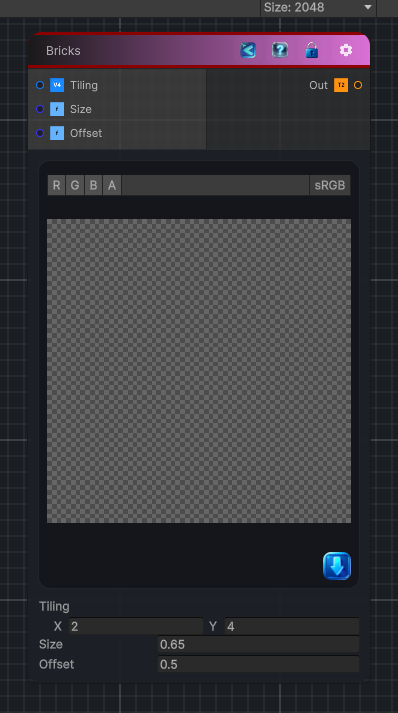

<link rel="stylesheet" href="../_assets/theme.css">

<button type="button" class="genesis-theme-toggle" data-genesis-theme-toggle aria-label="Toggle theme">Dark</button>

---
category: "Generators/Shapes"
---

# Bricks

> Generates a bricks pattern.

## Description

Generates a bricks pattern.

Inputs:
- No external inputs. This node generates its output from its internal parameters.

Settings:
- No additional settings. This node is controlled by its built-in behavior.

Output:
- A generated procedural texture or data output based on the node parameters.

## Inputs

| Name | Type | Description |
|------|------|-------------|
| Tiling | Vector4 |  |
| Size | Single |  |
| Offset | Single |  |

## Outputs

| Name | Type |
|------|------|
| Out | Texture2D |

## Parameters

| Setting | Type | Default | Description |
|---------|------|---------|-------------|
| Tiling | Vector, 2 | (2, 4, 0, 0) | Controls the tiling. |
| Size | Float | 0.65 | Controls the size. |
| Offset | Float | 0.5 | Controls the offset. |

## See Also

- [Back to Bricks](./generators-index.md)
