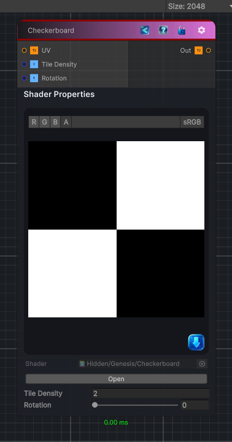

<link rel="stylesheet" href="../_assets/theme.css">

<button type="button" class="genesis-theme-toggle" data-genesis-theme-toggle aria-label="Toggle theme">Dark</button>

---
category: "Generators/Shapes"
---

# Checkerboard

> Generates checkerboard procedural noise.

## Description

Generates checkerboard procedural noise.

Inputs:
- No external inputs. This node generates its output from its internal parameters.

Settings:
- No additional settings. This node is controlled by its built-in behavior.

Output:
- A generated procedural texture based on the node parameters.

## Inputs

| Name | Type | Description |
|------|------|-------------|
| UV | Texture2D |  |
| Tile Density | Single | Number of tiles per axis |
| Rotation | Single | Rotation of the tiles, Degrees |

## Outputs

| Name | Type |
|------|------|
| Out | Texture2D |

## Parameters

| Setting | Type | Default | Description |
|---------|------|---------|-------------|
| Tile Density | int | 2 | Number of tiles per axis |
| Rotation | Range | 0 | Rotation of the tiles, Degrees |

## See Also

- [Back to Checkerboard](./generators-index.md)
