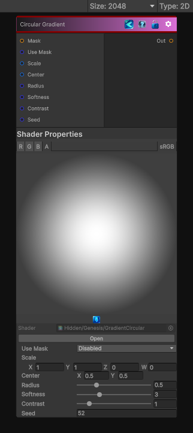

<link rel="stylesheet" href="../_assets/theme.css">

<button type="button" class="genesis-theme-toggle" data-genesis-theme-toggle aria-label="Toggle theme">Dark</button>

---
category: "Generators/Shapes"
---

# Circular Gradient

> Generates gradient circular procedural noise.

## Description

Generates gradient circular procedural noise.

Inputs:
- No external inputs. This node generates its output from its internal parameters.

Settings:
- No additional settings. This node is controlled by its built-in behavior.

Output:
- A generated procedural texture based on the node parameters.

## Inputs

| Name | Type | Description |
|------|------|-------------|

## Outputs

| Name | Type |
|------|------|

## Parameters

| Setting | Type | Default | Description |
|---------|------|---------|-------------|
| Use Mask | Enum | 0 | Controls the use mask. |
| Scale | Vector | (1,1,0,0) | Global tiling |
| Center | Vector2 | (0.5,0.5,0,0) | Center of gradient |
| Radius | Range | 0.5 | Radius of gradient |
| Softness | Range | 3.0 | Softness of falloff |
| Contrast | Range | 1.0 | Contrast shaping |
| Seed | int | 52 | Randomization seed |

## See Also

- [Back to Circular Gradient](./generators-index.md)
