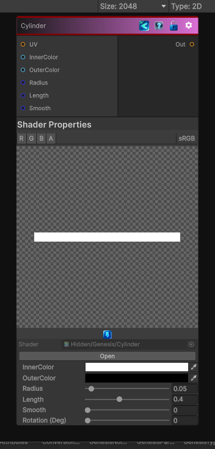

<link rel="stylesheet" href="../_assets/theme.css">

<button type="button" class="genesis-theme-toggle" data-genesis-theme-toggle aria-label="Toggle theme">Dark</button>

---
category: "Generators/Shapes"
---

# Cylinder

> Generates cylinder procedural content.

## Description

Generates cylinder procedural content.

Inputs:
- No external inputs. This node generates its output from its internal parameters.

Settings:
- No additional settings. This node is controlled by its built-in behavior.

Output:
- A generated procedural texture or data output based on the node parameters.

## Inputs

| Name | Type | Description |
|------|------|-------------|

## Outputs

| Name | Type |
|------|------|

## Parameters

| Setting | Type | Default | Description |
|---------|------|---------|-------------|
| Radius | Range | 0.05 | Controls the radius. |
| [Inspector] Scale | Vector | (1, 1, 1, 0) | Controls the [inspector] scale. |
| [Inspector] Offset | Vector | (0, 0, 0, 0) | Controls the [inspector] offset. |
| Smooth | Range | 0 | Controls the smooth. |
| Rotation (Deg) | Range | 0 | Controls the rotation (deg). |

## See Also

- [Back to Cylinder](./generators-index.md)
