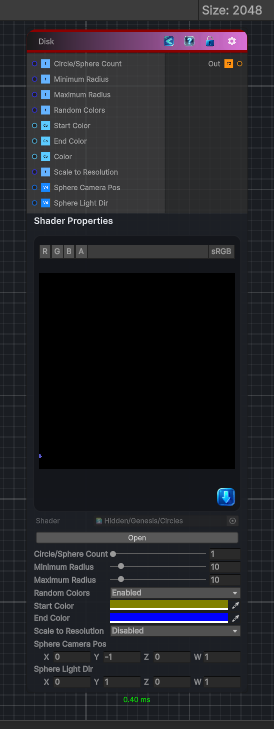

<link rel="stylesheet" href="../_assets/theme.css">

<button type="button" class="genesis-theme-toggle" data-genesis-theme-toggle aria-label="Toggle theme">Dark</button>

---
category: "Generators/Shapes"
---

# Disk

> Generates a circle pattern.

## Description

Generates a circle pattern.

Inputs:
- No external inputs. This node generates its output from its internal parameters.

Settings:
- No additional settings. This node is controlled by its built-in behavior.

Output:
- A generated procedural texture or data output based on the node parameters.

## Inputs

| Name | Type | Description |
|------|------|-------------|
| Circle/Sphere Count | Single |  |
| Minimum Radius | Single |  |
| Maximum Radius | Single |  |
| Random Colors | Single |  |
| Start Color | Color |  |
| End Color | Color |  |
| Color | Color |  |
| Scale to Resolution | Single |  |
| Sphere Camera Pos | Vector4 |  |
| Sphere Light Dir | Vector4 |  |

## Outputs

| Name | Type |
|------|------|
| Out | Texture2D |

## Parameters

| Setting | Type | Default | Description |
|---------|------|---------|-------------|
| Random Colors | Enum | 1 | Controls the random colors. |
| Start Color | Color | (0.5,0.5,0,1) | Controls the start color. |
| End Color | Color | (0,0,1,1) | Controls the end color. |
| Color | Color | (0.9,0.9,0.9,1) | Controls the color. |
| Scale to Resolution | Enum | 0 | Controls the scale to resolution. |
| Sphere Camera Pos | Vector | (0,-1,0) | Controls the sphere camera pos. |
| Sphere Light Dir | Vector | (0,1,0) | Controls the sphere light dir. |

## See Also

- [Back to Disk](./generators-index.md)
