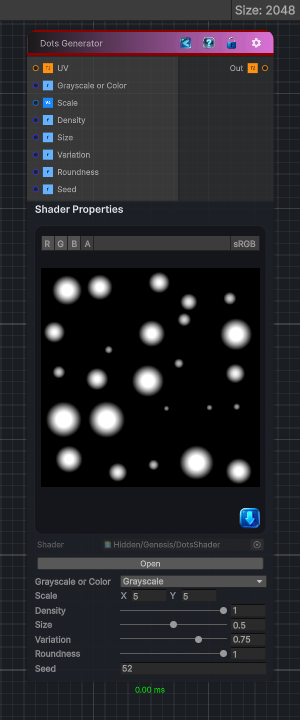

<link rel="stylesheet" href="../_assets/theme.css">

<button type="button" class="genesis-theme-toggle" data-genesis-theme-toggle aria-label="Toggle theme">Dark</button>

---
category: "Generators/Shapes"
---

# Dots

> Generates dots procedural noise.

## Description

Generates dots procedural noise.

Inputs:
- No external inputs. This node generates its output from its internal parameters.

Settings:
- No additional settings. This node is controlled by its built-in behavior.

Output:
- A generated procedural texture based on the node parameters.

## Inputs

| Name | Type | Description |
|------|------|-------------|
| UV | Texture2D |  |
| Grayscale or Color | Single | Grayscale or color output |
| Scale | Vector4 | Scale, minimum 2x2 |
| Density | Single | Density of the dots distribution |
| Size | Single | Size of the dots |
| Variation | Single | The variation of the size of the dots |
| Roundness | Single | The roundness of the dots |
| Seed | Single | Random seed |

## Outputs

| Name | Type |
|------|------|
| Out | Texture2D |

## Parameters

| Setting | Type | Default | Description |
|---------|------|---------|-------------|
| nodeVariables | VariableStorage | AhahGames.GenesisNoise.Graph.VariableStorage | |
| GUID | String | ca8791f5-0568-4e6b-ac04-8b1b965a8fdd | |
| expanded | Boolean | False | |

## See Also

- [Back to Dots](./generators-index.md)
