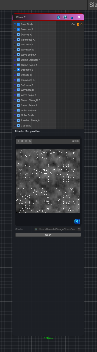

<link rel="stylesheet" href="../_assets/theme.css">

<button type="button" class="genesis-theme-toggle" data-genesis-theme-toggle aria-label="Toggle theme">Dark</button>

---
category: "Generators/Shapes"
---

# Fibers 2

> Generates a fibers 2 pattern.

## Description

Generates a fibers 2 pattern.

Inputs:
- No external inputs. This node generates its output from its internal parameters.

Settings:
- No additional settings. This node is controlled by its built-in behavior.

Output:
- A generated procedural texture or data output based on the node parameters.

## Inputs

| Name | Type | Description |
|------|------|-------------|
| Base Scale | Vector4 |  |
| Direction A | Vector4 |  |
| Density A | Single |  |
| Thickness A | Single |  |
| Softness A | Single |  |
| Waviness A | Single |  |
| Wave Scale A | Single |  |
| Clump Strength A | Single |  |
| Clump Scale A | Single |  |
| Direction B | Vector4 |  |
| Density B | Single |  |
| Thickness B | Single |  |
| Softness B | Single |  |
| Waviness B | Single |  |
| Wave Scale B | Single |  |
| Clump Strength B | Single |  |
| Clump Scale B | Single |  |
| Noise Amount | Single |  |
| Noise Scale | Single |  |
| Breakup Strength | Single |  |
| Contrast | Single |  |

## Outputs

| Name | Type |
|------|------|
| Out | Texture2D |

## Parameters

| Setting | Type | Default | Description |
|---------|------|---------|-------------|
| nodeVariables | VariableStorage | AhahGames.GenesisNoise.Graph.VariableStorage | |
| GUID | String | b5bb7949-c21c-4083-9dfe-f0c16635b825 | |
| expanded | Boolean | False | |

## See Also

- [Back to Fibers 2](./generators-index.md)
