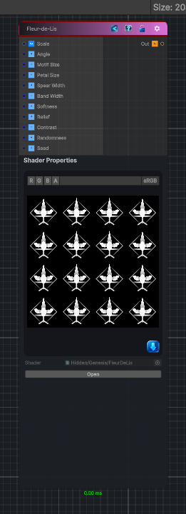

<link rel="stylesheet" href="../_assets/theme.css">

<button type="button" class="genesis-theme-toggle" data-genesis-theme-toggle aria-label="Toggle theme">Dark</button>

---
category: "Generators/Shapes"
---

# Fleur-de-Lis

> Generates fleur de lis procedural content.

## Description

Generates fleur de lis procedural content.

Inputs:
- No external inputs. This node generates its output from its internal parameters.

Settings:
- No additional settings. This node is controlled by its built-in behavior.

Output:
- A generated procedural texture or data output based on the node parameters.

## Inputs

| Name | Type | Description |
|------|------|-------------|
| Scale | Vector4 | Global tiling |
| Angle | Single | Rotation in radians |
| Motif Size | Single | Overall motif size |
| Petal Size | Single | Size of side petals |
| Spear Width | Single | Width of the central spear |
| Band Width | Single | Width of cross band and outline |
| Softness | Single | Soft edge |
| Relief | Single | Embossed relief amount |
| Contrast | Single | Contrast shaping |
| Randomness | Single | Random variation amount |
| Seed | Single | Random seed |

## Outputs

| Name | Type |
|------|------|
| Out | Texture2D |

## Parameters

| Setting | Type | Default | Description |
|---------|------|---------|-------------|
| Scale | Vector | (4,4,0,0) | Global tiling |
| Angle | Range | 0.0 | Rotation in radians |
| Motif Size | Range | 0.82 | Overall motif size |
| Petal Size | Range | 0.48 | Size of side petals |
| Spear Width | Range | 0.22 | Width of the central spear |
| Band Width | Range | 0.08 | Width of cross band and outline |
| Softness | Range | 0.035 | Soft edge |
| Relief | Range | 0.42 | Embossed relief amount |
| Contrast | Range | 1.15 | Contrast shaping |
| Randomness | Range | 0.0 | Random variation amount |
| Seed | int | 269 | Random seed |

## See Also

- [Back to Fleur-de-Lis](./generators-index.md)
