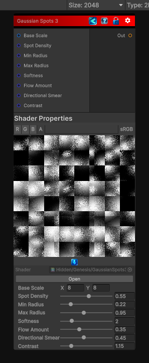

<link rel="stylesheet" href="../_assets/theme.css">

<button type="button" class="genesis-theme-toggle" data-genesis-theme-toggle aria-label="Toggle theme">Dark</button>

---
category: "Generators/Shapes"
---

# Gaussian Spots 3

> Generates gaussian spots 3 procedural noise.

## Description

Generates gaussian spots 3 procedural noise.

Inputs:
- No external inputs. This node generates its output from its internal parameters.

Settings:
- No additional settings. This node is controlled by its built-in behavior.

Output:
- A generated procedural texture based on the node parameters.

## Inputs

| Name | Type | Description |
|------|------|-------------|

## Outputs

| Name | Type |
|------|------|

## Parameters

| Setting | Type | Default | Description |
|---------|------|---------|-------------|
| Base Scale | Vector2 | (8,8,0,0) | Controls the base scale. |
| Spot Density | Range | 0.55 | Controls the spot density. |
| Min Radius | Range | 0.22 | Controls the min radius. |
| Max Radius | Range | 0.95 | Controls the max radius. |
| Softness | Range | 2.0 | Controls the softness. |
| Flow Amount | Range | 0.35 | Controls the flow amount. |
| Directional Smear | Range | 0.45 | Controls the directional smear. |
| Contrast | Range | 1.15 | Controls the contrast. |

## See Also

- [Back to Gaussian Spots 3](./generators-index.md)
