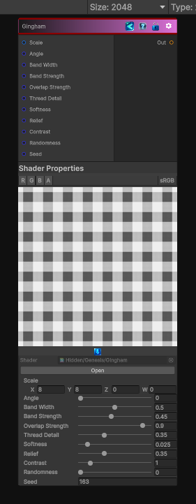

<link rel="stylesheet" href="../_assets/theme.css">

<button type="button" class="genesis-theme-toggle" data-genesis-theme-toggle aria-label="Toggle theme">Dark</button>

---
category: "Generators/Shapes"
---

# Gingham

> Generates a gingham pattern.

## Description

Generates a gingham pattern.

Inputs:
- No external inputs. This node generates its output from its internal parameters.

Settings:
- No additional settings. This node is controlled by its built-in behavior.

Output:
- A generated procedural texture or data output based on the node parameters.

## Inputs

| Name | Type | Description |
|------|------|-------------|

## Outputs

| Name | Type |
|------|------|

## Parameters

| Setting | Type | Default | Description |
|---------|------|---------|-------------|
| Scale | Vector | (8,8,0,0) | Global tiling |
| Angle | Range | 0.0 | Rotation in radians |
| Band Width | Range | 0.5 | Width of each gingham band |
| Band Strength | Range | 0.45 | Darkness of single direction bands |
| Overlap Strength | Range | 0.9 | Darkness of overlapping bands |
| Thread Detail | Range | 0.35 | Fine woven thread detail |
| Softness | Range | 0.025 | Soft edge |
| Relief | Range | 0.35 | Woven relief amount |
| Contrast | Range | 1.0 | Contrast shaping |
| Randomness | Range | 0.0 | Random variation amount |
| Seed | int | 163 | Random seed |

## See Also

- [Back to Gingham](./generators-index.md)
