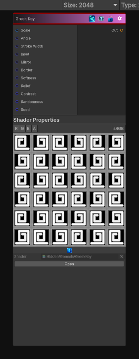

<link rel="stylesheet" href="../_assets/theme.css">

<button type="button" class="genesis-theme-toggle" data-genesis-theme-toggle aria-label="Toggle theme">Dark</button>

---
category: "Generators/Shapes"
---

# Greek Key

> Generates a greek key pattern.

## Description

Generates a greek key pattern.

Inputs:
- No external inputs. This node generates its output from its internal parameters.

Settings:
- No additional settings. This node is controlled by its built-in behavior.

Output:
- A generated procedural texture or data output based on the node parameters.

## Inputs

| Name | Type | Description |
|------|------|-------------|

## Outputs

| Name | Type |
|------|------|

## Parameters

| Setting | Type | Default | Description |
|---------|------|---------|-------------|
| Scale | Vector | (6,6,0,0) | Global tiling |
| Angle | Range | 0.0 | Rotation in radians |
| Stroke Width | Range | 0.11 | Width of the meander stroke |
| Inset | Range | 0.18 | Internal spacing of the spiral path |
| Mirror | Range | 1.0 | Alternate mirrored tiles |
| Border | Range | 0.35 | Secondary border amount |
| Softness | Range | 0.025 | Soft edge |
| Relief | Range | 0.35 | Raised stroke relief |
| Contrast | Range | 1.1 | Contrast shaping |
| Randomness | Range | 0.0 | Random variation amount |
| Seed | int | 181 | Random seed |

## See Also

- [Back to Greek Key](./generators-index.md)
