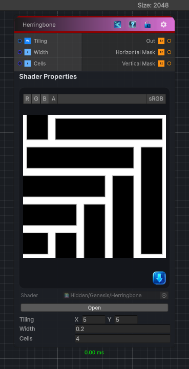

<link rel="stylesheet" href="../_assets/theme.css">

<button type="button" class="genesis-theme-toggle" data-genesis-theme-toggle aria-label="Toggle theme">Dark</button>

---
category: "Generators/Shapes"
---

# Herringbone

> Generates herringbone procedural noise.

## Description

Generates herringbone procedural noise.

Inputs:
- No external inputs. This node generates its output from its internal parameters.

Settings:
- No additional settings. This node is controlled by its built-in behavior.

Output:
- Horizontal Mask: Generated texture output.; Vertical Mask: Generated texture output.

## Inputs

| Name | Type | Description |
|------|------|-------------|
| Tiling | Vector4 |  |
| Width | Single |  |
| Cells | Single |  |

## Outputs

| Name | Type |
|------|------|
| Vertical Mask | Texture2D |
| Horizontal Mask | Texture2D |
| Out | Texture2D |

## Parameters

| Setting | Type | Default | Description |
|---------|------|---------|-------------|
| Tiling | Vector2 | (5, 5, 0, 0) | Controls the tiling. |
| Width | Float | 0.2 | Controls the width. |
| Cells | Float | 4 | Controls the cells. |
| Output Mode | Float | 0 | Controls the output mode. |

## See Also

- [Back to Herringbone](./generators-index.md)
