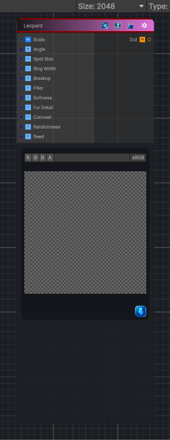

<link rel="stylesheet" href="../_assets/theme.css">

<button type="button" class="genesis-theme-toggle" data-genesis-theme-toggle aria-label="Toggle theme">Dark</button>

---
category: "Generators/Shapes"
---

# Leopard

> Generates a leopard pattern.

## Description

Generates a leopard pattern.

Inputs:
- No external inputs. This node generates its output from its internal parameters.

Settings:
- No additional settings. This node is controlled by its built-in behavior.

Output:
- A generated procedural texture or data output based on the node parameters.

## Inputs

| Name | Type | Description |
|------|------|-------------|
| Scale | Vector4 | Global tiling |
| Angle | Single | Rotation in radians |
| Spot Size | Single | Size of main rosettes |
| Ring Width | Single | Thickness of rosette rings |
| Breakup | Single | Amount of broken ring gaps |
| Filler | Single | Amount of small filler spots |
| Softness | Single | Soft edge |
| Fur Detail | Single | Furlike tonal grain |
| Contrast | Single | Contrast shaping |
| Randomness | Single | Random variation amount |
| Seed | Single | Random seed |

## Outputs

| Name | Type |
|------|------|
| Out | Texture2D |

## Parameters

| Setting | Type | Default | Description |
|---------|------|---------|-------------|
| Scale | Vector | (7,7,0,0) | Global tiling |
| Angle | Range | 0.0 | Rotation in radians |
| Spot Size | Range | 0.36 | Size of main rosettes |
| Ring Width | Range | 0.11 | Thickness of rosette rings |
| Breakup | Range | 0.55 | Amount of broken ring gaps |
| Filler | Range | 0.45 | Amount of small filler spots |
| Softness | Range | 0.035 | Soft edge |
| Fur Detail | Range | 0.35 | Furlike tonal grain |
| Contrast | Range | 1.2 | Contrast shaping |
| Randomness | Range | 0.65 | Random variation amount |
| Seed | int | 307 | Random seed |

## See Also

- [Back to Leopard](./generators-index.md)
