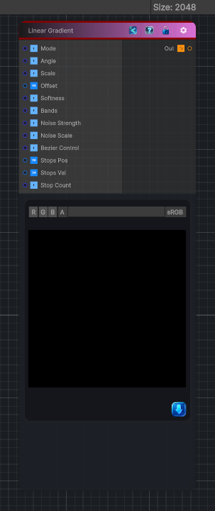

<link rel="stylesheet" href="../_assets/theme.css">

<button type="button" class="genesis-theme-toggle" data-genesis-theme-toggle aria-label="Toggle theme">Dark</button>

---
category: "Generators/Shapes"
---

# Linear Gradient

> Generates linear gradient procedural noise.

## Description

Generates linear gradient procedural noise.

Inputs:
- No external inputs. This node generates its output from its internal parameters.

Settings:
- No additional settings. This node is controlled by its built-in behavior.

Output:
- A generated procedural texture based on the node parameters.

## Inputs

| Name | Type | Description |
|------|------|-------------|
| Mode | Single | Gradient mode selector |
| Angle | Single | Angle for directional gradients |
| Scale | Single | Global scale |
| Offset | Vector4 | Offset for gradient center |
| Softness | Single | Softness contrast shaping |
| Bands | Single | Bands count for banded mode |
| Noise Strength | Single | Noise modulation strength |
| Noise Scale | Single | Noise scale |
| Bezier Control | Single | Bezier control point |
| Stops Pos | Vector4 | Multistop positions (0 to 1) |
| Stops Val | Vector4 | Multistop values (0 to 1) |
| Stop Count | Single | Number of stops |

## Outputs

| Name | Type |
|------|------|
| Out | Texture2D |

## Parameters

| Setting | Type | Default | Description |
|---------|------|---------|-------------|
| nodeVariables | VariableStorage | AhahGames.GenesisNoise.Graph.VariableStorage | |
| GUID | String | 0d90b683-c897-429b-8fe1-39578a1f25d4 | |
| expanded | Boolean | False | |

## See Also

- [Back to Linear Gradient](./generators-index.md)
