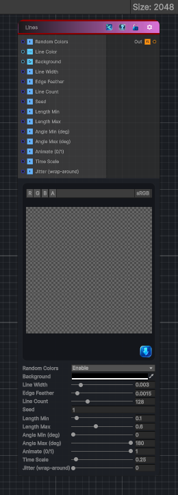

<link rel="stylesheet" href="../_assets/theme.css">

<button type="button" class="genesis-theme-toggle" data-genesis-theme-toggle aria-label="Toggle theme">Dark</button>

---
category: "Generators/Shapes"
---

# Lines

> Generates a lines pattern.

## Description

Generates a lines pattern.

Inputs:
- No external inputs. This node generates its output from its internal parameters.

Settings:
- No additional settings. This node is controlled by its built-in behavior.

Output:
- A generated procedural texture or data output based on the node parameters.

## Inputs

| Name | Type | Description |
|------|------|-------------|
| Random Colors | Single |  |
| Line Color | Color |  |
| Background | Color |  |
| Line Width | Single |  |
| Edge Feather | Single |  |
| Line Count | Single |  |
| Seed | Single |  |
| Length Min | Single |  |
| Length Max | Single |  |
| Angle Min (deg) | Single |  |
| Angle Max (deg) | Single |  |
| Animate (0/1) | Single |  |
| Time Scale | Single |  |
| Jitter (wrap-around) | Single |  |

## Outputs

| Name | Type |
|------|------|
| Out | Texture2D |

## Parameters

| Setting | Type | Default | Description |
|---------|------|---------|-------------|
| Random Colors | Enum | 1 | Controls the random colors. |
| Line Color | Color | (1,1,1,1) | Controls the line color. |
| Background | Color | (0,0,0,1) | Controls the background. |
| Line Width | Range | 0.003 | Controls the line width. |
| Edge Feather | Range | 0.0015 | Controls the edge feather. |
| Line Count | Range | 128 | Controls the line count. |
| Seed | Float | 1.0 | Controls the seed. |
| Length Min | Range | 0.10 | Controls the length min. |
| Length Max | Range | 0.60 | Controls the length max. |
| Angle Min (deg) | Range | 0 | Controls the angle min (deg). |
| Angle Max (deg) | Range | 180 | Controls the angle max (deg). |
| Animate (0/1) | Range | 1 | Controls the animate (0/1). |
| Time Scale | Range | 0.25 | Controls the time scale. |
| Jitter (wrap-around) | Range | 0.0 | Controls the jitter (wrap-around). |

## See Also

- [Back to Lines](./generators-index.md)
