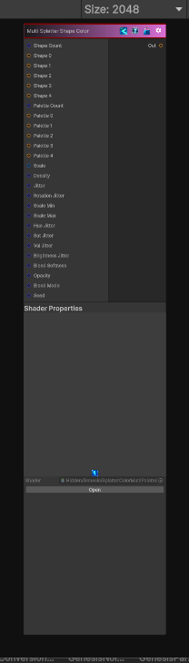

<link rel="stylesheet" href="../_assets/theme.css">

<button type="button" class="genesis-theme-toggle" data-genesis-theme-toggle aria-label="Toggle theme">Dark</button>

---
category: "Generators/Shapes"
---

# Multi Splatter Shape Color

> Generates a multi splatter shape color pattern.

## Description

Generates a multi splatter shape color pattern.

Inputs:
- No external inputs. This node generates its output from its internal parameters.

Settings:
- No additional settings. This node is controlled by its built-in behavior.

Output:
- A generated procedural texture or data output based on the node parameters.

## Inputs

| Name | Type | Description |
|------|------|-------------|

## Outputs

| Name | Type |
|------|------|

## Parameters

| Setting | Type | Default | Description |
|---------|------|---------|-------------|
| Shape Count | int | 3 | Controls the shape count. |
| Palette Count | int | 3 | Controls the palette count. |
| Scale | Vector | (8,8,0,0) | Global tiling |
| Density | Range | 8 | Instances per cell |
| Jitter | Range | 0.4 | Position jitter |
| Rotation Jitter | Range | 3.14 | Rotation jitter |
| Scale Min | Range | 0.4 | Scale min |
| Scale Max | Range | 1.2 | Scale max |
| Hue Jitter | Range | 0.2 | Hue jitter |
| Sat Jitter | Range | 0.2 | Saturation jitter |
| Val Jitter | Range | 0.2 | Value jitter |
| Brightness Jitter | Range | 0.2 | Brightness jitter |
| Blend Softness | Range | 0.2 | Blend softness |
| Opacity | Range | 1.0 | Opacity |
| Blend Mode | Enum | 0 | Controls the blend mode. |
| Seed | int | 52 | Controls the seed. |

## See Also

- [Back to Multi Splatter Shape Color](./generators-index.md)
