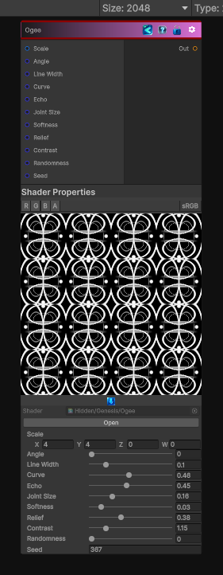

<link rel="stylesheet" href="../_assets/theme.css">

<button type="button" class="genesis-theme-toggle" data-genesis-theme-toggle aria-label="Toggle theme">Dark</button>

---
category: "Generators/Shapes"
---

# Ogee

> Generates a ogee pattern.

## Description

Generates a ogee pattern.

Inputs:
- No external inputs. This node generates its output from its internal parameters.

Settings:
- No additional settings. This node is controlled by its built-in behavior.

Output:
- A generated procedural texture or data output based on the node parameters.

## Inputs

| Name | Type | Description |
|------|------|-------------|

## Outputs

| Name | Type |
|------|------|

## Parameters

| Setting | Type | Default | Description |
|---------|------|---------|-------------|
| Scale | Vector | (4,4,0,0) | Global tiling |
| Angle | Range | 0.0 | Rotation in radians |
| Line Width | Range | 0.10 | Width of ogee frame lines |
| Curve | Range | 0.46 | Height and sweep of the ogee curve |
| Echo | Range | 0.45 | Amount of inner echo ornament |
| Joint Size | Range | 0.16 | Size of rounded joints |
| Softness | Range | 0.03 | Soft edge |
| Relief | Range | 0.38 | Raised line relief |
| Contrast | Range | 1.15 | Contrast shaping |
| Randomness | Range | 0.0 | Random variation amount |
| Seed | int | 367 | Random seed |

## See Also

- [Back to Ogee](./generators-index.md)
