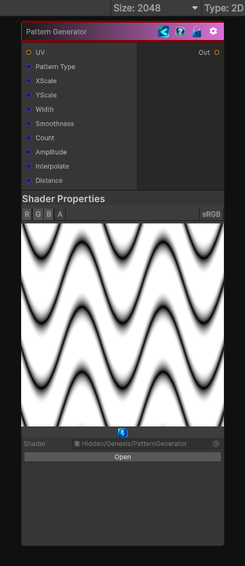

<link rel="stylesheet" href="../_assets/theme.css">

<button type="button" class="genesis-theme-toggle" data-genesis-theme-toggle aria-label="Toggle theme">Dark</button>

---
category: "Generators/Shapes"
---

# Pattern

> Generates pattern procedural noise.

## Description

Generates pattern procedural noise.

Inputs:
- No external inputs. This node generates its output from its internal parameters.

Settings:
- No additional settings. This node is controlled by its built-in behavior.

Output:
- A generated procedural texture based on the node parameters.

## Inputs

| Name | Type | Description |
|------|------|-------------|

## Outputs

| Name | Type |
|------|------|

## Parameters

| Setting | Type | Default | Description |
|---------|------|---------|-------------|
| Pattern Type | Enum | 0 | Controls the pattern type. |
| XScale | Range | 5 | X Scale |
| YScale | Range | 5 | Y Scale |
| Width | Range | 1 | Controls the width. |
| Smoothness | Range | 0.5 | Smoothness |
| Count | Range | 5 | Controls the count. |
| Amplitude | Range | 1 | Controls the amplitude. |
| Interpolate | Range | 1 | Controls the interpolate. |
| Distance | Range | 0.5 | Controls the distance. |

## See Also

- [Back to Pattern](./generators-index.md)
